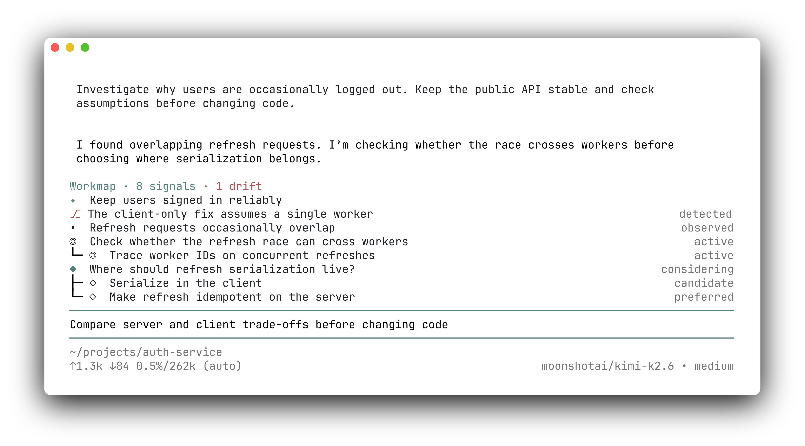

# pi-workmap



> **See what your agent intends before it acts — and why.**

`pi-workmap` is a Pi extension maintained proactively by the LLM Agent. It distills the Agent's current direction, understandings, decisions, actions, and detected drift into a persistent workmap you can scan at any time; when something looks off, correct it in conversation and the Agent updates both the map and its course.

## Installation

Local installation:

```bash
pi install .
```

## Usage

On every user prompt, before its first action, the Agent re-declares the complete map via the `workmap` tool — what you see is everything the Agent has declared, and it is never more than one prompt old. Mid-task course changes are reported the moment they happen through `add_drift`. A non-empty map always carries a `current` heading (where the user just pointed) and a `long-term` heading (the project-level direction this session serves); updates that exceed 10 signals or drop a heading are rejected whole, so what reaches the widget is always a map the Agent explicitly chose.

## Session behavior

- Every `/tree` branch in the same session file shares the latest workmap; switching branches never rolls it back.
- `resume` restores the session's latest workmap.
- `fork` inherits the current workmap, then evolves independently from the parent session.
- A `new session` starts with an empty workmap.
