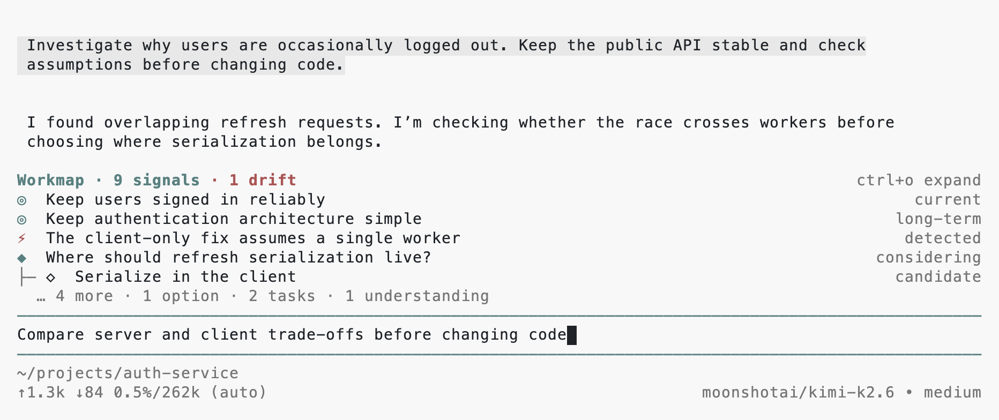

# UI Demos

Workmap 是 editor 上方的常驻 widget。它复用 Pi 官方 `app.tools.expand` 状态：按 `Ctrl+O` 时，tool output 与 workmap 一起在 compact / expanded 之间切换。


## Visual language

```text
◎  Heading
•  Understanding
◆  Decision
◇  Option
□  Task
⚡ Drift
```

用色遵循 Pi 和 `pi-tasks` 的克制方式：正文与普通 glyph 使用默认文字色；Goal / Decision glyph 使用 accent，Drift 使用 error；`status`、tree connector 与 `note` 使用 dim。灰色只表示辅助信息，不额外编码领域状态。

颜色表达的是"晚看的代价"而非严重程度：Drift 是唯一成本随延迟增长的信号——用户没看到的每一分钟，Agent 都可能带着偏差继续干活——所以它用最抢眼的 error 色；accent 用于定位方向（Heading / Decision）。Drift 本身只是"提请确认"：用户可以纠正、接受，或等待相关工作自然完成。如果实践中 Drift 频繁出现，应先修 Agent 的过度报告，而不是调低颜色。

克制同样适用于文本：widget 里不允许解释性文字——没有图例、没有栏目标题、没有"what/why/how"式描述，意义由 glyph、颜色和 tree 结构承载。Agent（尤其 GPT）倾向于在 UI 上补充文本说明，这被视为需要压制的默认行为，而不是可选的润色。

## Generic map

```text
Workmap · 8 signals                                      ctrl+o compact
◎ Fix flaky auth test                                         current
├─ • Failure only happens concurrently                        observed
├─ • Token cache is shared                                    observed
├─ □ Check whether refresh can race                            active
├─ ◆ Inspect refresh path first                               chosen
│     Failure looks state-related.
└─ □ Reproduce                                                done
   ├─ □ Inspect refresh path                                  active
   └─ □ Test hypothesis                                      queued
```

Heading 是可选的方向信号，不是强制容器。多个 Heading 可以平级，其他节点也可以作为 root。

## Authentication bug

```text
Workmap · 9 signals                                      ctrl+o compact
◎ Stop users being randomly logged out                        current
• Access token expiry looks normal                             observed
• Refresh requests occasionally overlap                       observed
◆ Should refresh serialization live on server or client?  considering
├─ ◇ Client-side serialization
│     Smaller server change, but assumes one client instance.
├─ ◇ Server idempotency
│     More robust across workers, but a larger change.
└─ □ Compare approaches                                       active
□ Reproduce race                                               done
□ Inspect refresh handler                                     active
```

Decision 表示需要权衡或已承诺的选择：斟酌中时 title 可以写成疑问句，拍板后改写为结论。Option 只放在 Decision 下；待验证的猜测写成 `Understanding · hypothesis`。事实问题不设节点类型——能查的直接调查，只有用户能答的在对话中问。

## Compact mode



```text
Workmap · 9 signals · 1 drift                            ctrl+o expand
◎ Keep users signed in reliably                               current
◎ Keep authentication architecture simple                   long-term
⚡ The client-only fix assumes a single worker              detected
◆ Where should refresh serialization live?               considering
├─ ◇ Serialize in the client                              candidate
  … 4 more · 1 option · 2 tasks · 1 understanding
```

compact 按 cluster 采样而不是按节点：子节点脱离 parent 会失去意义（Option 离开 Decision 什么都不是），所以每个 root 连同子树作为一个采样单位，按簇内最高对齐价值排序（Heading、Drift、Decision、Task 优先），最多取 5 行、每个 cluster 最多 3 行，被采样的簇以缩进 tree 渲染。它用于持续扫读，不试图容纳完整结构。`… N more` 附带被隐藏节点的类型计数，帮助用户判断是否值得展开。

## Heading correction

```text
Workmap · 7 signals · 1 drift                            ctrl+o compact
◎ Preserve existing client behavior                           current
⚡ Implementation started changing the public API            detected
   The user asked for an internal fix without API changes.
◆ Keep the public API stable                                  chosen
□ Move serialization behind the existing refresh method       active
```

Drift 出现意味着 Agent 已识别真实不一致；它不是泛化的风险清单。偏差消解后应删除——无论消解来自用户纠正、用户接受（结论转为 Decision / Understanding），还是相关工作自然完成——而不是作为历史记录保留。用户未明确回应时 drift 应保留；沉默不等于接受。

## Layout rules

- widget 常驻 editor 上方，不使用 overlay，也不提供 human editor；纠正发生在对话中。
- compact 以 cluster 为单位采样、每簇最多 3 行；expanded 显示完整 tree 与最多两行 note。
- header 的 drift 计数使用 error 色；drift 是唯一"晚看比早看贵"的信号，显著性必须第一。
- Heading 类型的 root 在 expanded 视图与注入快照中始终置顶：锚先于细节。
- 所有 glyph 统一按两个终端列宽的单元格渲染，双宽的 ⚡ 与其他 glyph 的 title 保持同列左对齐。
- `status` 只在 title 至少保留 20 列时右对齐；窄终端先隐藏 status 与快捷键 hint，优先保留 title。
- node title 保持单行可扫读，note 只解释必要证据、条件或 trade-off。
- V1 只有 `parentId` tree；不显示 refs 或 DAG edges。
